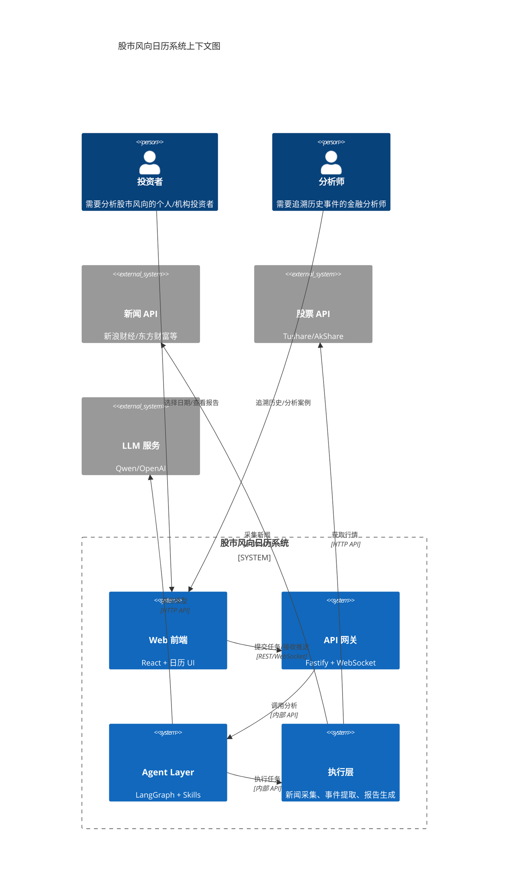
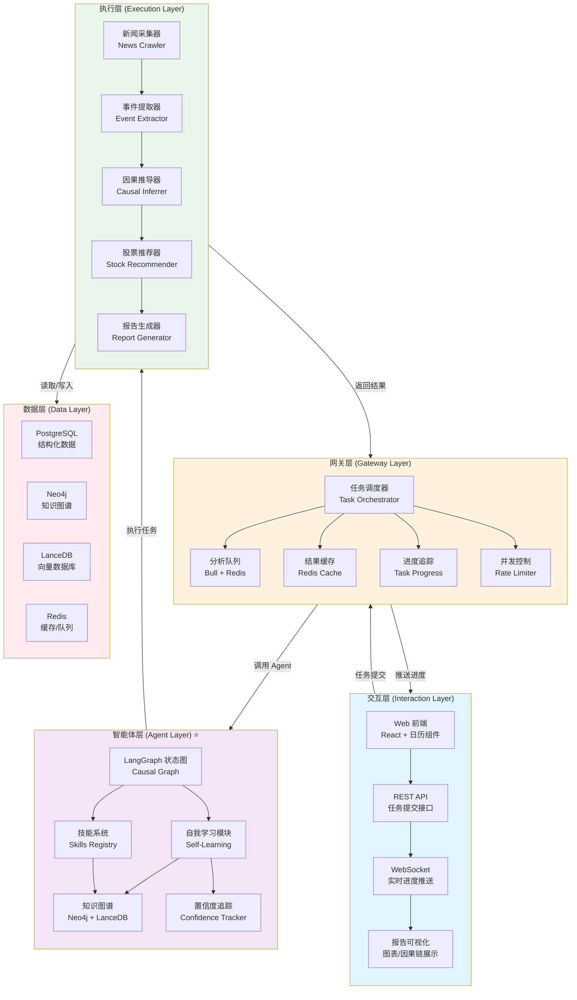
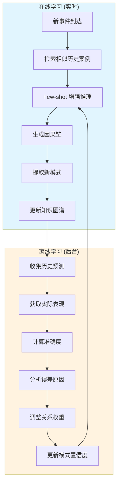
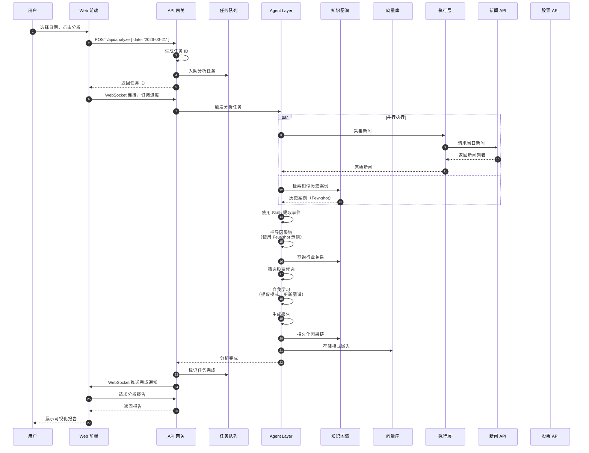

# 股市风向日历 - 系统架构设计文档

**版本**: 1.0.0  
**日期**: 2026-03-21  
**状态**: 设计稿

---

## 📋 目录

1. [架构概览](#架构概览)
2. [四层架构设计](#四层架构设计)
3. [Agent Layer 详细设计](#agent-layer-详细设计)
4. [技能系统](#技能系统)
5. [自我学习机制](#自我学习机制)
6. [知识图谱](#知识图谱)
7. [数据流设计](#数据流设计)
8. [技术栈](#技术栈)
9. [目录结构](#目录结构)

---

## 架构概览

### 核心设计理念

借鉴 OpenClaw 项目的**四层架构**经验，结合 LangGraph TypeScript 实现支持**自我学习**的 Agent Layer。

**核心创新点**：
- ✅ 不手动定义因果链模板
- ✅ 通过 Skills 系统让大模型自行总结因果模式
- ✅ 具备自我学习和持续优化能力
- ✅ 基于 LangGraph TypeScript 构建状态图引擎

### 系统上下文图



---

## 四层架构设计

### 架构图



### 各层职责

| 层级 | 职责 | 关键技术 |
|------|------|----------|
| **交互层** | 用户界面、API 接口、实时推送 | React, Fastify, WebSocket |
| **网关层** | 任务调度、队列管理、缓存、并发控制 | Bull, Redis, Rate Limiter |
| **智能体层** | 因果推导、技能执行、自我学习 | LangGraph, LLM, Neo4j, LanceDB |
| **执行层** | 新闻采集、事件提取、报告生成 | Puppeteer, Axios, Template Engine |

---

## Agent Layer 详细设计

### LangGraph 状态图

#### 状态定义

```typescript
interface AnalysisState {
  // ========== 输入 ==========
  selectedDate: string;
  rawNews: NewsItem[];
  
  // ========== 中间状态 ==========
  extractedEvents: Event[];
  causalChains: CausalChain[];
  industryImpacts: IndustryImpact[];
  stockCandidates: StockCandidate[];
  
  // ========== 学习状态 ==========
  learnedPatterns: CausalPattern[];
  similarHistoricalCases: HistoricalCase[];
  confidenceScores: Map<string, number>;
  
  // ========== 输出 ==========
  finalReport: AnalysisReport;
  stockRecommendations: StockRecommendation[];
}
```

#### Graph 结构

```typescript
import { StateGraph, END } from '@langchain/langgraph';

const causalInferenceGraph = StateGraph<AnalysisState>
  // Node 定义
  .addNode('news_collector', collectNews)
  .addNode('event_extractor', extractEventsWithSkill)
  .addNode('causal_chain_inferrer', inferCausalChains)
  .addNode('industry_analyzer', analyzeIndustryImpact)
  .addNode('stock_screener', screenStocks)
  .addNode('self_learner', learnFromAnalysis)
  .addNode('report_generator', generateReport)
  
  // 边定义
  .addEdge('START', 'news_collector')
  .addEdge('news_collector', 'event_extractor')
  .addEdge('event_extractor', 'causal_chain_inferrer')
  
  // 条件路由：根据因果链复杂度决定是否需要深度行业分析
  .addConditionalEdges(
    'causal_chain_inferrer',
    'shouldDeepDive',
    {
      'deep_dive': 'industry_analyzer',
      'direct': 'stock_screener'
    }
  )
  
  .addEdge('industry_analyzer', 'stock_screener')
  .addEdge('stock_screener', 'self_learner')
  .addEdge('self_learner', 'report_generator')
  .addEdge('report_generator', 'END');

// 条件函数
function shouldDeepDive(state: AnalysisState): 'deep_dive' | 'direct' {
  // 如果因果链涉及多个行业或复杂传导，进行深度分析
  const industriesInvolved = new Set(
    state.causalChains.flatMap(chain => chain.affectedIndustries)
  );
  return industriesInvolved.size > 2 ? 'deep_dive' : 'direct';
}
```

### Node 详细设计

#### Node 1: 新闻采集

```typescript
async function collectNews(state: AnalysisState): Promise<Partial<AnalysisState>> {
  const { selectedDate } = state;
  
  // 并行采集多个新闻源
  const [sina, eastmoney, jin10] = await Promise.all([
    fetchSinaFinance(selectedDate),
    fetchEastMoney(selectedDate),
    fetchJin10(selectedDate)
  ]);
  
  // 去重和标准化
  const deduplicated = deduplicateNews([...sina, ...eastmoney, ...jin10]);
  
  return { rawNews: deduplicated };
}
```

#### Node 2: 事件提取（使用 Skill）

```typescript
async function extractEventsWithSkill(
  state: AnalysisState,
  skills: SkillRegistry
): Promise<Partial<AnalysisState>> {
  const { rawNews } = state;
  
  // 并行使用不同事件提取技能
  const events = await Promise.all(
    rawNews.map(async (news) => {
      // 根据新闻内容自动选择合适的技能
      const skill = skills.selectSkill(news.content, [
        'extract_geopolitical_event',
        'extract_macro_event',
        'extract_industry_event',
        'extract_policy_event'
      ]);
      
      return await skill.execute(news);
    })
  );
  
  return { extractedEvents: events.filter(Boolean) };
}
```

#### Node 3: 因果链推导（核心）

```typescript
async function inferCausalChains(
  state: AnalysisState,
  skills: SkillRegistry,
  knowledgeGraph: KnowledgeGraph
): Promise<Partial<AnalysisState>> {
  const { extractedEvents } = state;
  
  // 1. 检索相似历史案例（Few-shot learning）
  const similarCases = await knowledgeGraph.retrieveSimilarCases(extractedEvents);
  
  // 2. 使用因果推导技能
  const causalChains = await skills.invoke('infer_event_chain', {
    events: extractedEvents,
    fewShotExamples: similarCases.map(c => c.causalChain)
  });
  
  // 3. 为每条因果链计算初始置信度
  const confidenceScores = calculateConfidence(causalChains, similarCases);
  
  return { 
    causalChains,
    similarHistoricalCases: similarCases,
    confidenceScores
  };
}
```

#### Node 6: 自我学习（核心创新）

```typescript
async function learnFromAnalysis(
  state: AnalysisState,
  skills: SkillRegistry,
  knowledgeGraph: KnowledgeGraph
): Promise<Partial<AnalysisState>> {
  const { causalChains, stockCandidates } = state;
  
  // 1. 从当前因果链中提取通用模式
  const patterns = await skills.invoke('extract_causal_pattern', {
    causalChains
  });
  
  // 2. 更新知识图谱
  for (const chain of causalChains) {
    await skills.invoke('update_knowledge_graph', {
      causalChain: chain
    });
  }
  
  // 3. 记录学习元数据
  const learningMetadata = {
    timestamp: Date.now(),
    patternsExtracted: patterns.length,
    chainsProcessed: causalChains.length,
    stocksAnalyzed: stockCandidates.length
  };
  
  return { learnedPatterns: patterns };
}
```

---

## 技能系统

### 技能分类

```typescript
// 技能接口
interface Skill<P, R> {
  name: string;
  description: string;
  execute: (params: P, context: SkillContext) => Promise<R>;
  metadata: {
    version: string;
    learnedFrom?: string[];  // 从哪些案例学习得到
    confidence?: number;     // 置信度
  };
}
```

### 技能清单

#### 1. 事件提取技能

```typescript
// 地缘政治事件提取
const extractGeopoliticalEvent: Skill<NewsItem, Event> = {
  name: 'extract_geopolitical_event',
  description: '从新闻中提取地缘政治事件（战争、外交、制裁等）',
  execute: async (news, context) => {
    const prompt = `
      从以下新闻中提取地缘政治事件：
      
      新闻标题：${news.title}
      新闻内容：${news.content}
      
      提取以下信息：
      1. 事件类型（战争/外交/制裁/恐怖袭击/其他）
      2. 涉及国家/地区
      3. 时间
      4. 关键参与方
      5. 事件描述
    `;
    
    const response = await context.llm.invoke(prompt);
    return parseEvent(response);
  },
  metadata: { version: '1.0.0' }
};

// 宏观经济事件提取
const extractMacroEvent: Skill<NewsItem, Event> = {
  name: 'extract_macro_event',
  description: '从新闻中提取宏观经济事件（利率、通胀、就业等）',
  execute: async (news, context) => {
    // 类似实现...
  },
  metadata: { version: '1.0.0' }
};
```

#### 2. 因果推导技能

```typescript
// 因果链推导
const inferEventChain: Skill<CausalInferenceParams, CausalChain> = {
  name: 'infer_event_chain',
  description: '推导事件之间的因果关系链',
  execute: async (params, context) => {
    const { events, fewShotExamples } = params;
    
    // 构建 Few-shot Prompt
    const fewShotText = fewShotExamples.map(example => `
      示例因果链：
      起始事件：${example.startEvent}
      传导路径：${example.chain.join(' → ')}
      最终影响：${example.endImpact}
    `).join('\n');
    
    const prompt = `
      ${fewShotText}
      
      请推导以下事件的因果链：
      ${events.map(e => `- ${e.type}: ${e.description}`).join('\n')}
      
      推导步骤：
      1. 识别直接影响（如：地缘冲突 → 原油价格上涨）
      2. 推导二级影响（如：原油上涨 → 航运成本上升）
      3. 推导三级影响（如：航运成本 → 新能源替代需求）
      4. 映射到具体行业和公司
    `;
    
    const response = await context.llm.invoke(prompt);
    return parseCausalChain(response);
  },
  metadata: { version: '1.0.0' }
};

// 行业影响映射
const mapIndustryImpact: Skill<CausalChain, IndustryImpact[]> = {
  name: 'map_industry_impact',
  description: '将因果链映射到具体行业影响',
  execute: async (chain, context) => {
    // 查询知识图谱中的行业关系
    const industryRelations = await context.knowledgeGraph.query(`
      MATCH (e:Event {id: $eventId})-[:AFFECTS]->(i:Industry)
      RETURN i.name, i.sector, r.impactScore, r.delay
    `, { eventId: chain.startEvent.id });
    
    return industryRelations.map(rel => ({
      industry: rel.i.name,
      sector: rel.i.sector,
      impactScore: rel.r.impactScore,
      delay: rel.r.delay
    }));
  },
  metadata: { version: '1.0.0' }
};
```

#### 3. 自我学习技能

```typescript
// 因果模式提取
const extractCausalPattern: Skill<PatternExtractionParams, CausalPattern[]> = {
  name: 'extract_causal_pattern',
  description: '从历史因果链中提取通用模式',
  execute: async (params, context) => {
    const { causalChains } = params;
    
    const prompt = `
      从以下具体因果链中提取通用的因果模式：
      
      ${causalChains.map(chain => `
        因果链 ${chain.id}:
        ${chain.steps.map(step => `  - ${step.event} → ${step.impact}`).join('\n')}
      `).join('\n\n')}
      
      提取要求：
      1. 抽象出通用事件类型（如"地缘冲突"而非"美伊战争"）
      2. 抽象出通用传导路径（如"原油价格 → 航运成本"）
      3. 识别模式适用的行业类别
      4. 标注模式的置信度
    `;
    
    const response = await context.llm.invoke(prompt);
    return parsePatterns(response);
  },
  metadata: { version: '1.0.0' }
};

// 预测验证
const validatePrediction: Skill<ValidationParams, LearningFeedback> = {
  name: 'validate_prediction',
  description: '验证推荐股票的实际表现，生成学习反馈',
  execute: async (params, context) => {
    const { recommendation, actualPerformance } = params;
    
    // 计算预测准确度
    const accuracy = calculateAccuracy(
      recommendation.predictedImpact,
      actualPerformance.priceChange
    );
    
    // 分析误差原因
    if (accuracy < 0.7) {
      const errorAnalysis = await context.llm.invoke(`
        预测准确度：${accuracy}
        
        原始因果链：${JSON.stringify(recommendation.basedOnChain)}
        实际表现：${JSON.stringify(actualPerformance)}
        
        请分析预测误差的原因：
        1. 因果链推导是否有误？
        2. 是否忽略了重要因素？
        3. 影响延迟是否估计错误？
        4. 行业映射是否准确？
      `);
      
      return {
        accuracy,
        errorAnalysis: parseErrorAnalysis(errorAnalysis),
        adjustments: generateAdjustments(errorAnalysis)
      };
    }
    
    return { accuracy, errorAnalysis: null, adjustments: [] };
  },
  metadata: { version: '1.0.0' }
};

// 知识图谱更新
const updateKnowledgeGraph: Skill<GraphUpdateParams, void> = {
  name: 'update_knowledge_graph',
  description: '根据新的因果链更新知识图谱',
  execute: async (params, context) => {
    const { causalChain } = params;
    
    // 1. 创建或更新事件节点
    await context.neo4j.run(`
      MERGE (e:Event {id: $eventId})
      SET e.type = $type,
          e.title = $title,
          e.embedding = $embedding
    `, {
      eventId: causalChain.startEvent.id,
      type: causalChain.startEvent.type,
      title: causalChain.startEvent.title,
      embedding: await context.embedder.embed(causalChain.startEvent.description)
    });
    
    // 2. 创建或更新因果关系
    for (const step of causalChain.steps) {
      await context.neo4j.run(`
        MATCH (source:Event {id: $sourceId})
        MATCH (target:Industry {name: $targetName})
        MERGE (source)-[r:AFFECTS]->(target)
        SET r.strength = COALESCE(r.strength, 0) + $strength,
            r.confidence = $confidence,
            r.lastUpdated = timestamp()
      `, {
        sourceId: step.event.id,
        targetName: step.affectedIndustry,
        strength: step.impactMagnitude,
        confidence: causalChain.confidence
      });
    }
  },
  metadata: { version: '1.0.0' }
};
```

### 技能注册表

```typescript
class SkillRegistry {
  private skills: Map<string, Skill<any, any>> = new Map();
  private skillEmbeddings: Map<string, number[]> = new Map();
  
  // 注册技能
  register(skill: Skill<any, any>): void {
    this.skills.set(skill.name, skill);
    // 为技能生成嵌入（用于语义检索）
    const embedding = await this.embedder.embed(skill.description);
    this.skillEmbeddings.set(skill.name, embedding);
  }
  
  // 根据语义相似度选择最合适的技能
  selectSkill(query: string, candidateSkillNames: string[]): Skill<any, any> {
    const queryEmbedding = this.embedder.embedSync(query);
    
    // 计算余弦相似度
    const similarities = candidateSkillNames.map(name => ({
      name,
      similarity: cosineSimilarity(
        queryEmbedding,
        this.skillEmbeddings.get(name)!
      )
    }));
    
    // 选择最相似的技能
    const bestMatch = similarities.sort((a, b) => b.similarity - a.similarity)[0];
    return this.skills.get(bestMatch.name)!;
  }
  
  // 调用技能
  async invoke<T, R>(skillName: string, params: T): Promise<R> {
    const skill = this.skills.get(skillName);
    if (!skill) {
      throw new Error(`Skill not found: ${skillName}`);
    }
    
    const context: SkillContext = {
      llm: this.llm,
      knowledgeGraph: this.knowledgeGraph,
      embedder: this.embedder
    };
    
    return await skill.execute(params, context);
  }
}
```

---

## 自我学习机制

### 学习流程图



### 学习策略

#### 1. Few-shot 学习（在线）

```typescript
async function retrieveSimilarCases(
  currentEvents: Event[],
  vectorStore: VectorStore,
  topK: number = 5
): Promise<HistoricalCase[]> {
  // 将当前事件向量化
  const eventText = currentEvents.map(e => e.description).join(' ');
  const queryEmbedding = await embedder.embed(eventText);
  
  // 检索相似历史案例
  const similarCases = await vectorStore.similaritySearch(queryEmbedding, {
    topK,
    filter: {
      // 只检索过去 2 年的案例
      timestamp: { gte: Date.now() - 2 * 365 * 24 * 60 * 60 * 1000 }
    }
  });
  
  return similarCases;
}
```

#### 2. 模式提取（在线）

```typescript
async function extractPatterns(causalChains: CausalChain[]): Promise<CausalPattern[]> {
  // 使用 LLM 从具体案例中抽象通用模式
  const prompt = `
    从以下 ${causalChains.length} 条因果链中提取通用因果模式：
    
    ${causalChains.map((chain, i) => `
      【案例 ${i + 1}】
      事件：${chain.startEvent.type} - ${chain.startEvent.description}
      传导：${chain.steps.map(s => `${s.event} → ${s.impact}`).join(' → ')}
      行业：${chain.affectedIndustries.join(', ')}
    `).join('\n')}
    
    提取通用模式：
    1. 事件类型 → 直接影响 → 二级影响 → 最终行业
    2. 标注每个环节的置信度
    3. 识别模式边界（什么情况下不适用）
  `;
  
  const response = await llm.invoke(prompt);
  return parsePatterns(response);
}
```

#### 3. 预测验证（离线）

```typescript
class PredictionValidator {
  // 定期验证历史预测
  async validateHistoricalPredictions(): Promise<ValidationReport> {
    const predictions = await this.loadPredictions({
      status: 'pending_validation',
      createdAfter: Date.now() - 30 * 24 * 60 * 60 * 1000  // 过去 30 天
    });
    
    const results = await Promise.all(
      predictions.map(async (prediction) => {
        const actualPerformance = await this.fetchActualPerformance(
          prediction.stockSymbol,
          prediction.predictionDate
        );
        
        return await this.validateSinglePrediction(prediction, actualPerformance);
      })
    );
    
    return this.generateValidationReport(results);
  }
  
  // 单个预测验证
  private async validateSinglePrediction(
    prediction: StockPrediction,
    actual: StockPerformance
  ): Promise<SingleValidationResult> {
    const accuracy = this.calculateAccuracy(prediction, actual);
    
    // 如果准确度低，分析原因
    let errorAnalysis: ErrorAnalysis | null = null;
    if (accuracy < 0.7) {
      errorAnalysis = await this.analyzeError(prediction, actual);
    }
    
    return {
      predictionId: prediction.id,
      accuracy,
      errorAnalysis,
      timestamp: Date.now()
    };
  }
  
  // 误差分析
  private async analyzeError(
    prediction: StockPrediction,
    actual: StockPerformance
  ): Promise<ErrorAnalysis> {
    const prompt = `
      预测准确度低，请分析原因：
      
      原始因果链：${JSON.stringify(prediction.causalChain)}
      预测影响：${prediction.predictedImpact}
      实际表现：${actual}
      
      可能的误差原因：
      1. 因果链推导错误（事件→行业传导有误）
      2. 影响程度估计错误（高估/低估）
      3. 影响延迟估计错误（时间偏差）
      4. 遗漏重要因素（其他对冲事件）
      5. 行业映射错误（选错行业/公司）
      
      请指出最可能的原因，并给出改进建议。
    `;
    
    const response = await this.llm.invoke(prompt);
    return parseErrorAnalysis(response);
  }
}
```

#### 4. 置信度演化

```typescript
class ConfidenceTracker {
  // 记录每次预测的置信度变化
  async trackConfidence(
    chainId: string,
    events: Array<{
      timestamp: number;
      predictedConfidence: number;
      actualAccuracy?: number;
    }>
  ): Promise<number> {
    // 使用贝叶斯更新置信度
    const priorConfidence = events[0].predictedConfidence;
    const likelihoods = events
      .filter(e => e.actualAccuracy !== undefined)
      .map(e => e.actualAccuracy!);
    
    // 贝叶斯公式：后验 ∝ 先验 × 似然
    const posteriorConfidence = this.bayesianUpdate(
      priorConfidence,
      likelihoods
    );
    
    // 更新知识图谱中的置信度
    await this.neo4j.run(`
      MATCH (e:Event {id: $chainId})
      SET e.confidence = $confidence,
          e.lastUpdated = timestamp()
    `, { chainId, confidence: posteriorConfidence });
    
    return posteriorConfidence;
  }
  
  // 贝叶斯更新
  private bayesianUpdate(prior: number, likelihoods: number[]): number {
    const n = likelihoods.length;
    if (n === 0) return prior;
    
    const avgLikelihood = likelihoods.reduce((a, b) => a + b, 0) / n;
    
    // 加权平均（先验权重随样本数增加而降低）
    const priorWeight = 1 / (n + 1);
    const dataWeight = n / (n + 1);
    
    return prior * priorWeight + avgLikelihood * dataWeight;
  }
}
```

---

## 知识图谱

### Schema 设计

```typescript
// Neo4j 节点标签
type NodeLabel = 'Event' | 'Industry' | 'Stock' | 'CausalPattern';

// 关系类型
type RelationshipType = 
  | 'CAUSES'           // 事件→事件
  | 'AFFECTS'          // 事件→行业
  | 'BELONGS_TO'       // 行业→行业（子行业）
  | 'IMPACTS'          // 行业→股票
  | 'SIMILAR_TO'       // 事件→事件（相似案例）
  | 'DERIVED_FROM';    // 模式→案例

// 事件节点
interface EventNode {
  id: string;
  label: 'Event';
  properties: {
    type: 'GEOPOLITICAL' | 'MACRO' | 'INDUSTRY' | 'POLICY';
    title: string;
    description: string;
    timestamp: number;
    source: string;
    embedding: number[];  // 向量嵌入
    confidence: number;   // 置信度
  };
}

// 行业节点
interface IndustryNode {
  id: string;
  label: 'Industry';
  properties: {
    name: string;
    sector: string;  // 一级行业
    subsector?: string;  // 二级行业
    sensitivity: number;  // 对事件的敏感度
    historicalReactions: HistoricalReaction[];
  };
}

// 股票节点
interface StockNode {
  id: string;
  label: 'Stock';
  properties: {
    symbol: string;
    name: string;
    industry: string;
    marketCap: number;
    historicalReactions: Array<{
      eventId: string;
      priceChange: number;
      volumeChange: number;
      delay: number;
    }>;
  };
}

// 因果关系
interface CausalRelation {
  source: string;  // Event ID
  target: string;  // Event ID 或 Industry ID
  type: 'CAUSES' | 'AFFECTS';
  properties: {
    strength: number;      // 因果强度 [0, 1]
    confidence: number;    // 置信度
    delay: number;         // 影响延迟（天）
    learnedFrom: string[]; // 来源案例 ID
    lastUpdated: number;
  };
}
```

### 查询示例

```typescript
class KnowledgeGraphQueries {
  // 查询事件影响的行业
  async queryEventImpact(eventId: string): Promise<IndustryImpact[]> {
    const result = await this.neo4j.run(`
      MATCH (e:Event {id: $eventId})-[r:AFFECTS]->(i:Industry)
      RETURN i.name, i.sector, r.strength, r.confidence, r.delay
      ORDER BY r.strength DESC
    `, { eventId });
    
    return result.records.map(record => ({
      industry: record.get('i.name'),
      sector: record.get('i.sector'),
      strength: record.get('r.strength'),
      confidence: record.get('r.confidence'),
      delay: record.get('r.delay')
    }));
  }
  
  // 查询相似历史事件
  async querySimilarEvents(
    queryEmbedding: number[],
    topK: number = 5
  ): Promise<HistoricalEvent[]> {
    // 使用向量相似度搜索
    const result = await this.neo4j.run(`
      MATCH (e:Event)
      WHERE e.embedding IS NOT NULL
      WITH e, vector.similarity.cosine(e.embedding, $query) AS similarity
      WHERE similarity > 0.7
      RETURN e, similarity
      ORDER BY similarity DESC
      LIMIT $topK
    `, { query: queryEmbedding, topK });
    
    return result.records.map(record => ({
      event: record.get('e'),
      similarity: record.get('similarity')
    }));
  }
  
  // 查询行业的历史反应
  async queryIndustryHistory(
    industryName: string,
    eventType: string
  ): Promise<HistoricalReaction[]> {
    const result = await this.neo4j.run(`
      MATCH (e:Event {type: $eventType})-[:AFFECTS]->(i:Industry {name: $industry})
      MATCH (i)-[:IMPACTS]->(s:Stock)
      RETURN e.timestamp, e.title, s.symbol, s.name, 
             s.historicalReactions AS reactions
      ORDER BY e.timestamp DESC
      LIMIT 10
    `, { eventType, industry: industryName });
    
    return result.records.map(record => ({
      eventTimestamp: record.get('e.timestamp'),
      eventTitle: record.get('e.title'),
      stockSymbol: record.get('s.symbol'),
      stockName: record.get('s.name'),
      reactions: record.get('reactions')
    }));
  }
}
```

---

## 数据流设计

### 完整数据流



### 缓存策略

```typescript
class ResultCache {
  // 缓存键：日期 + 新闻源哈希
  private generateCacheKey(date: string, newsHash: string): string {
    return `analysis:${date}:${newsHash}`;
  }
  
  // 检查缓存
  async get(date: string, newsHash: string): Promise<AnalysisReport | null> {
    const key = this.generateCacheKey(date, newsHash);
    const cached = await this.redis.get(key);
    return cached ? JSON.parse(cached) : null;
  }
  
  // 设置缓存（过期时间 7 天）
  async set(
    date: string,
    newsHash: string,
    report: AnalysisReport
  ): Promise<void> {
    const key = this.generateCacheKey(date, newsHash);
    await this.redis.setex(key, 7 * 24 * 60 * 60, JSON.stringify(report));
  }
  
  // 缓存失效（当知识图谱更新时）
  async invalidateForEvent(eventId: string): Promise<void> {
    const affectedDates = await this.findAffectedDates(eventId);
    const keys = affectedDates.map(d => `analysis:${d}:*`);
    await this.redis.del(...keys);
  }
}
```

---

## 技术栈

### 核心技术

```json
{
  "runtime": {
    "node": ">=18.0.0",
    "typescript": ">=5.0.0"
  },
  "langchain": {
    "@langchain/core": "^0.3.x",
    "@langchain/langgraph": "^0.2.x",
    "@langchain/qwen": "^0.1.x"
  },
  "database": {
    "neo4j-driver": "^5.x",
    "@lancedb/lancedb": "^0.10.x",
    "pg": "^8.x",
    "ioredis": "^5.x"
  },
  "web": {
    "fastify": "^4.x",
    "ws": "^8.x",
    "@fastify/cors": "^9.x",
    "@fastify/websocket": "^8.x"
  },
  "queue": {
    "bull": "^4.x"
  },
  "utils": {
    "zod": "^1.x",
    "pino": "^8.x",
    "dotenv": "^16.x"
  }
}
```

### LLM 选择

| 场景 | 推荐模型 | 理由 |
|------|----------|------|
| 事件提取 | Qwen-Max / GPT-4 | 高精度，支持复杂指令 |
| 因果推导 | Qwen-Max / GPT-4 | 逻辑推理能力强 |
| 模式提取 | Qwen-Max / GPT-4 | 抽象概括能力 |
| 报告生成 | Qwen-Plus / GPT-3.5 | 成本效益高 |

---

## 目录结构

```
kline/
├── docs/
│   └── kline/
│       ├── PRODUCT_REQUIREMENT.md
│       └── ARCHITECTURE_DESIGN.md
├── src/
│   ├── index.ts                          # 入口
│   │
│   ├── gateway/
│   │   ├── server.ts                     # Fastify 服务器
│   │   ├── routes/
│   │   │   ├── analysis.route.ts         # 分析任务路由
│   │   │   └── report.route.ts           # 报告查询路由
│   │   ├── websocket/
│   │   │   └── progress-handler.ts       # 进度推送处理
│   │   └── task-orchestrator.ts          # 任务编排
│   │
│   ├── agent/
│   │   ├── graph/
│   │   │   ├── causal-graph.ts           # LangGraph 定义
│   │   │   ├── nodes/
│   │   │   │   ├── news-collector.node.ts
│   │   │   │   ├── event-extractor.node.ts
│   │   │   │   ├── causal-inferrer.node.ts
│   │   │   │   ├── industry-analyzer.node.ts
│   │   │   │   ├── stock-screener.node.ts
│   │   │   │   ├── self-learner.node.ts
│   │   │   │   └── report-generator.node.ts
│   │   │   └── edges/
│   │   │       └── conditional-edges.ts
│   │   │
│   │   ├── skills/
│   │   │   ├── registry.ts               # 技能注册表
│   │   │   ├── base/
│   │   │   │   ├── skill.interface.ts
│   │   │   │   └── skill-context.ts
│   │   │   ├── event-extraction/
│   │   │   │   ├── geopolitical.skill.ts
│   │   │   │   ├── macro.skill.ts
│   │   │   │   ├── industry.skill.ts
│   │   │   │   └── policy.skill.ts
│   │   │   ├── causal-inference/
│   │   │   │   ├── chain-inference.skill.ts
│   │   │   │   └── industry-mapping.skill.ts
│   │   │   └── self-learning/
│   │   │       ├── pattern-extraction.skill.ts
│   │   │       ├── validation.skill.ts
│   │   │       └── knowledge-update.skill.ts
│   │   │
│   │   ├── learning/
│   │   │   ├── self-learning-agent.ts
│   │   │   ├── confidence-tracker.ts
│   │   │   └── feedback-loop.ts
│   │   │
│   │   └── runtime/
│   │       ├── agent-runtime.ts
│   │       └── state-manager.ts
│   │
│   ├── execution/
│   │   ├── news-collector.ts
│   │   ├── event-extractor.ts
│   │   ├── causal-chain-inferrer.ts
│   │   ├── stock-recommender.ts
│   │   └── report-generator.ts
│   │
│   ├── knowledge/
│   │   ├── graph/
│   │   │   ├── neo4j-driver.ts
│   │   │   ├── event.repository.ts
│   │   │   ├── industry.repository.ts
│   │   │   └── stock.repository.ts
│   │   └── vector/
│   │       ├── lancedb-driver.ts
│   │       └── pattern-store.ts
│   │
│   ├── infrastructure/
│   │   ├── queue/
│   │   │   └── analysis-queue.ts
│   │   ├── cache/
│   │   │   └── result-cache.ts
│   │   └── outbound/
│   │       ├── news-api-adapter.ts
│   │       └── stock-api-adapter.ts
│   │
│   ├── config/
│   │   ├── index.ts
│   │   ├── schema.ts                     # Zod schema
│   │   └── env.ts
│   │
│   └── types/
│       ├── event.ts
│       ├── causal-chain.ts
│       ├── industry.ts
│       ├── stock.ts
│       └── report.ts
│
├── web/                                  # React 前端
│   ├── src/
│   │   ├── components/
│   │   │   ├── Calendar/
│   │   │   ├── Report/
│   │   │   └── CausalChain/
│   │   └── pages/
│   │       └── Analysis.tsx
│   └── package.json
│
├── package.json
├── tsconfig.json
└── README.md
```

---

## 下一步行动

### Phase 1: MVP（2 周）
- [ ] 搭建基础架构（Gateway + Queue）
- [ ] 实现 LangGraph 状态图
- [ ] 实现基础 Skills（事件提取、因果推导）
- [ ] 集成新闻 API
- [ ] 简单报告生成

### Phase 2: 知识图谱（2 周）
- [ ] 部署 Neo4j
- [ ] 实现知识图谱 Repository
- [ ] 实现向量检索（LanceDB）
- [ ] 集成 Few-shot 学习

### Phase 3: 自我学习（2 周）
- [ ] 实现模式提取技能
- [ ] 实现预测验证机制
- [ ] 实现置信度追踪
- [ ] 实现反馈闭环

### Phase 4: 前端与优化（2 周）
- [ ] 开发 React 日历界面
- [ ] 实现因果链可视化
- [ ] 性能优化
- [ ] 并发测试

---

## 总结

本架构设计借鉴 OpenClaw 的**四层架构**经验，结合 **LangGraph TypeScript** 实现了一个支持**自我学习**的 Agent Layer。

### 核心优势

1. ✅ **无需手动定义因果链模板** - 通过 Skills 系统让 LLM 自行总结
2. ✅ **自我学习能力** - 从历史案例学习、预测验证、持续优化
3. ✅ **Few-shot 增强** - 检索相似案例提升推理准确性
4. ✅ **知识图谱持久化** - Neo4j 存储事件 - 行业 - 股票关系
5. ✅ **置信度追踪** - 贝叶斯更新置信度，可追溯可审计

### 技术亮点

- 使用 LangGraph 构建状态图，支持条件路由和循环
- Skills 系统设计支持语义检索和动态加载
- 在线学习（Few-shot）+ 离线学习（预测验证）双循环
- 知识图谱 + 向量数据库混合存储

---

**文档状态**: 设计稿 v1.0  
**最后更新**: 2026-03-21
