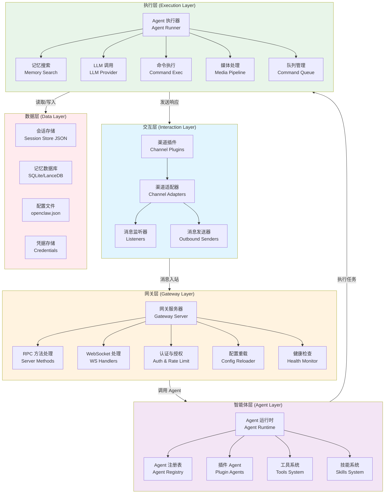
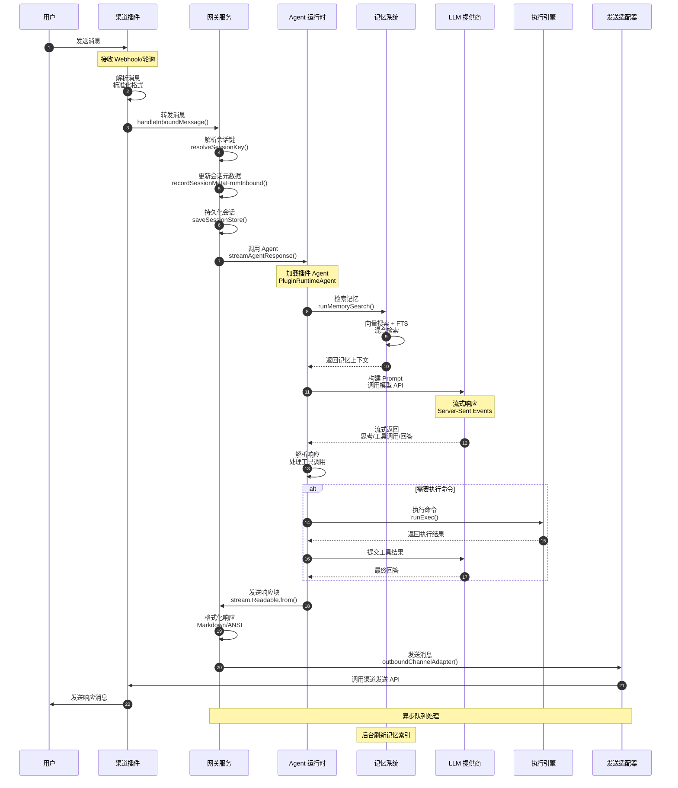
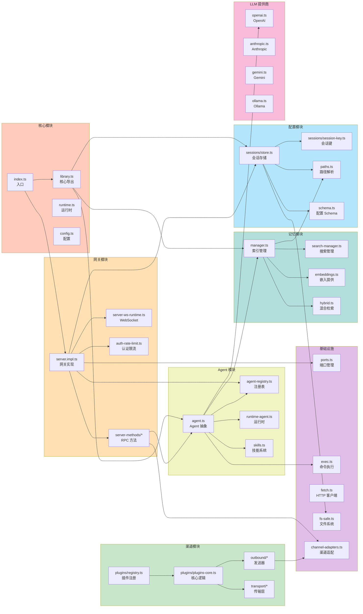
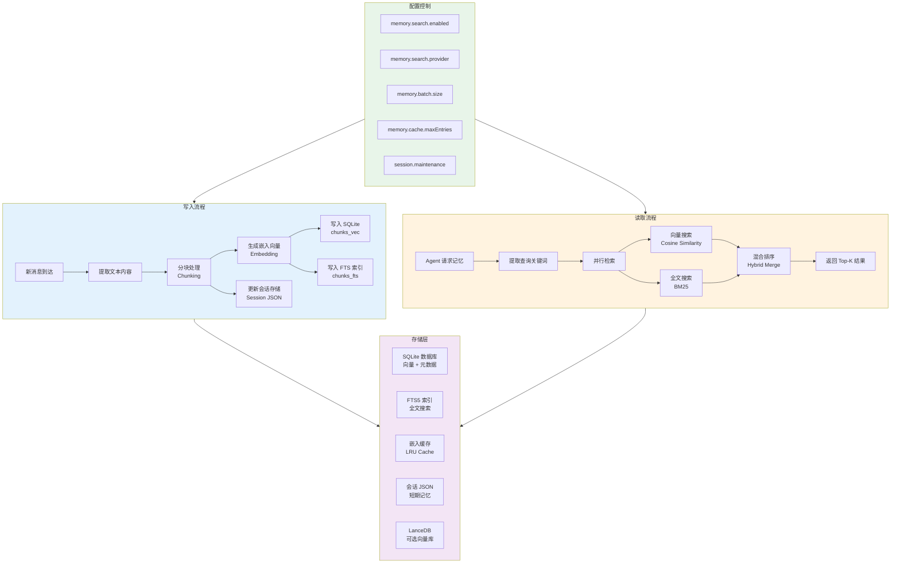
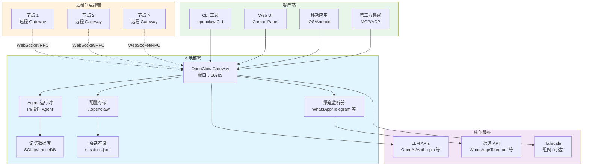

```mermaid
C4Context
  title OpenClaw 系统上下文图

  Person(user, "用户", "通过消息渠道发送消息的终端用户")
  Person(admin, "管理员", "配置和管理 OpenClaw 系统的运维人员")

  System_Boundary(openclaw, "OpenClaw 系统") {
    System(gateway, "网关服务", "OpenClaw Gateway", "核心服务，处理消息路由、Agent 管理和插件加载")
    System(channels, "渠道系统", "Channel Plugins", "消息渠道适配层")
    System(agents, "Agent 系统", "Agent Runtime", "智能体执行引擎")
    System(memory, "记忆系统", "Memory System", "三级记忆存储与检索")
    System(config, "配置系统", "Configuration", "配置和会话管理")
  }

  System_Ext(whatsapp, "WhatsApp", "Meta", "消息渠道")
  System_Ext(telegram, "Telegram", "Telegram", "消息渠道")
  System_Ext(discord, "Discord", "Discord", "消息渠道")
  System_Ext(slack, "Slack", "Salesforce", "消息渠道")
  System_Ext(imessage, "iMessage", "Apple", "消息渠道")
  System_Ext(signal, "Signal", "Signal Foundation", "消息渠道")
  System_Ext(line, "LINE", "LY Corporation", "消息渠道")
  System_Ext(zalo, "Zalo", "VNG Corporation", "消息渠道")

  System_Ext(openai, "OpenAI API", "OpenAI", "LLM 服务提供商")
  System_Ext(anthropic, "Anthropic API", "Anthropic", "LLM 服务提供商")
  System_Ext(gemini, "Google Gemini", "Google", "LLM 服务提供商")
  System_Ext(qwen, "Qwen API", "Alibaba", "LLM 服务提供商")
  System_Ext(ollama, "Ollama", "本地", "本地 LLM 运行")

  System_Ext(filesystem, "文件系统", "本地/远程", "存储会话、记忆、配置")
  System_Ext(remote_node, "远程节点", "OpenClaw Node", "分布式节点")

  Rel(user, whatsapp, "发送/接收消息")
  Rel(user, telegram, "发送/接收消息")
  Rel(user, discord, "发送/接收消息")
  Rel(user, slack, "发送/接收消息")
  Rel(user, imessage, "发送/接收消息")
  Rel(user, signal, "发送/接收消息")
  Rel(user, line, "发送/接收消息")
  Rel(user, zalo, "发送/接收消息")

  Rel(whatsapp, channels, "Webhook/Polling", "HTTPS")
  Rel(telegram, channels, "Webhook/Polling", "HTTPS")
  Rel(discord, channels, "Gateway API", "WebSocket")
  Rel(slack, channels, "Events API", "HTTPS")
  Rel(imessage, channels, "AppleScript/DB", "本地 IPC")
  Rel(signal, channels, "Signal CLI", "本地 IPC")
  Rel(line, channels, "Webhook", "HTTPS")
  Rel(zalo, channels, "Webhook", "HTTPS")

  Rel(channels, gateway, "消息转发", "内部 API")
  Rel(gateway, agents, "调用执行", "内部 API")
  Rel(agents, memory, "读写记忆", "SQLite/LanceDB")
  Rel(gateway, config, "加载配置", "JSON")
  Rel(config, filesystem, "持久化", "JSON/SQLite")

  Rel(agents, openai, "调用模型", "HTTPS API")
  Rel(agents, anthropic, "调用模型", "HTTPS API")
  Rel(agents, gemini, "调用模型", "HTTPS API")
  Rel(agents, qwen, "调用模型", "HTTPS API")
  Rel(agents, ollama, "调用模型", "HTTP")

  Rel(admin, gateway, "配置管理", "CLI/Web")
  Rel(gateway, remote_node, "节点通信", "WebSocket/RPC")
  Rel(remote_node, filesystem, "分布式存储", "网络")

  UpdateRelStyle(user, whatsapp, $offsetY="-60")
  UpdateRelStyle(user, telegram, $offsetY="-40")
  UpdateRelStyle(user, discord, $offsetY="-20")
  UpdateRelStyle(user, slack, $offsetY="0")
  UpdateRelStyle(user, imessage, $offsetY="20")
  UpdateRelStyle(user, signal, $offsetY="40")
  UpdateRelStyle(user, line, $offsetY="60")
  UpdateRelStyle(user, zalo, $offsetY="80")

  UpdateLayoutConfig($c4ShapeInRow="4", $c4BoundaryInRow="1")
```

# OpenClaw 架构图系列

**项目版本**: 2026.3.14  
**分析日期**: 2026-03-21  
**分析范围**: src/, extensions/, package.json

---

## 图 1：系统上下文图 (System Context Diagram)

### 说明

展示 OpenClaw 与外部系统的交互关系，包括支持的消息渠道、LLM 服务提供商、文件系统和本地/远程节点。

### 架构图

### 关键组件映射

| 图中组件     | 源文件路径                                                                                                             | 说明              |
| ------------ | ---------------------------------------------------------------------------------------------------------------------- | ----------------- |
| 网关服务     | [`src/gateway/server.impl.ts`](file:///Users/zhuzy/zhuzy/kitz-openclaw/src/gateway/server.impl.ts)                     | 核心网关实现      |
| 渠道系统     | [`src/channels/plugins/registry.ts`](file:///Users/zhuzy/zhuzy/kitz-openclaw/src/channels/plugins/registry.ts)         | 渠道插件注册表    |
| Agent 系统   | [`src/auto-reply/reply/agent-runner.ts`](file:///Users/zhuzy/zhuzy/kitz-openclaw/src/auto-reply/reply/agent-runner.ts) | Agent 执行器      |
| Agent 运行时 | [`src/plugins/runtime/runtime-agent.ts`](file:///Users/zhuzy/zhuzy/kitz-openclaw/src/plugins/runtime/runtime-agent.ts) | 插件 Agent 运行时 |
| 记忆系统     | [`src/memory/manager.ts`](file:///Users/zhuzy/zhuzy/kitz-openclaw/src/memory/manager.ts)                               | 记忆索引管理      |
| 记忆搜索     | [`src/memory/search-manager.ts`](file:///Users/zhuzy/zhuzy/kitz-openclaw/src/memory/search-manager.ts)                 | 记忆搜索管理器    |
| 配置系统     | [`src/config/config.ts`](file:///Users/zhuzy/zhuzy/kitz-openclaw/src/config/config.ts)                                 | 配置加载          |
| 会话存储     | [`src/config/sessions/store.ts`](file:///Users/zhuzy/zhuzy/kitz-openclaw/src/config/sessions/store.ts)                 | 会话数据存储      |
| WhatsApp     | [`extensions/whatsapp`](file:///Users/zhuzy/zhuzy/kitz-openclaw/extensions/whatsapp)                                   | WhatsApp 渠道插件 |
| Telegram     | [`extensions/telegram`](file:///Users/zhuzy/zhuzy/kitz-openclaw/extensions/telegram)                                   | Telegram 渠道插件 |
| Discord      | [`extensions/discord`](file:///Users/zhuzy/zhuzy/kitz-openclaw/extensions/discord)                                     | Discord 渠道插件  |

---

## 图 2：四层架构总览图 (Four-Layer Architecture)

### 说明

展示 OpenClaw 的四层架构模型：交互层、网关层、智能体层、执行层，以及各层之间的调用关系。

### 架构图

### 关键组件映射

| 层级     | 组件         | 源文件路径                                                                                                                           | 说明                        |
| -------- | ------------ | ------------------------------------------------------------------------------------------------------------------------------------ | --------------------------- |
| 交互层   | 渠道插件     | [`src/channels/plugins/registry.ts`](file:///Users/zhuzy/zhuzy/kitz-openclaw/src/channels/plugins/registry.ts)                       | 渠道插件注册表              |
| 交互层   | 渠道类型     | [`src/channels/plugins/types.ts`](file:///Users/zhuzy/zhuzy/kitz-openclaw/src/channels/plugins/types.ts)                             | 渠道插件类型定义            |
| 交互层   | 渠道适配器   | [`src/infra/outbound/channel-adapters.ts`](file:///Users/zhuzy/zhuzy/kitz-openclaw/src/infra/outbound/channel-adapters.ts)           | 出站消息适配器              |
| 交互层   | 消息监听     | 各渠道插件 webhook 文件 (如 `src/telegram/webhook.ts`)                                                                               | 各渠道独立实现 webhook/轮询 |
| 网关层   | 网关服务器   | [`src/gateway/server.impl.ts`](file:///Users/zhuzy/zhuzy/kitz-openclaw/src/gateway/server.impl.ts)                                   | 核心网关实现                |
| 网关层   | RPC 方法列表 | [`src/gateway/server-methods-list.ts`](file:///Users/zhuzy/zhuzy/kitz-openclaw/src/gateway/server-methods-list.ts)                   | RPC 方法定义列表            |
| 网关层   | RPC 方法实现 | [`src/gateway/server-methods.ts`](file:///Users/zhuzy/zhuzy/kitz-openclaw/src/gateway/server-methods.ts)                             | 核心 RPC 方法实现           |
| 网关层   | Agent 方法   | [`src/gateway/server-methods/agent.ts`](file:///Users/zhuzy/zhuzy/kitz-openclaw/src/gateway/server-methods/agent.ts)                 | Agent 相关 RPC 方法         |
| 网关层   | WebSocket    | [`src/gateway/server-ws-runtime.ts`](file:///Users/zhuzy/zhuzy/kitz-openclaw/src/gateway/server-ws-runtime.ts)                       | WebSocket 连接处理          |
| 智能体层 | Agent 运行时 | [`src/plugins/runtime/runtime-agent.ts`](file:///Users/zhuzy/zhuzy/kitz-openclaw/src/plugins/runtime/runtime-agent.ts)               | 插件 Agent 运行时           |
| 智能体层 | Agent 执行器 | [`src/auto-reply/reply/agent-runner.ts`](file:///Users/zhuzy/zhuzy/kitz-openclaw/src/auto-reply/reply/agent-runner.ts)               | Agent 执行引擎              |
| 智能体层 | Agent 作用域 | [`src/agents/agent-scope.ts`](file:///Users/zhuzy/zhuzy/kitz-openclaw/src/agents/agent-scope.ts)                                     | Agent ID 解析和作用域管理   |
| 智能体层 | 技能系统     | [`src/agents/skills/`](file:///Users/zhuzy/zhuzy/kitz-openclaw/src/agents/skills/)                                                   | 技能加载和管理              |
| 执行层   | 记忆搜索     | [`src/memory/search-manager.ts`](file:///Users/zhuzy/zhuzy/kitz-openclaw/src/memory/search-manager.ts)                               | 记忆搜索管理器              |
| 执行层   | 记忆集成     | [`src/auto-reply/reply/agent-runner-memory.ts`](file:///Users/zhuzy/zhuzy/kitz-openclaw/src/auto-reply/reply/agent-runner-memory.ts) | Agent 记忆集成              |
| 执行层   | LLM 提供商   | [`src/agents/model-catalog.ts`](file:///Users/zhuzy/zhuzy/kitz-openclaw/src/agents/model-catalog.ts)                                 | 模型目录和配置              |
| 执行层   | 命令队列     | [`src/process/command-queue.ts`](file:///Users/zhuzy/zhuzy/kitz-openclaw/src/process/command-queue.ts)                               | 异步命令队列                |
| 数据层   | 会话存储     | [`src/config/sessions/store.ts`](file:///Users/zhuzy/zhuzy/kitz-openclaw/src/config/sessions/store.ts)                               | 会话数据存储                |
| 数据层   | 会话类型     | [`src/config/sessions/types.ts`](file:///Users/zhuzy/zhuzy/kitz-openclaw/src/config/sessions/types.ts)                               | 会话数据结构                |
| 数据层   | 配置文件     | [`src/config/config.ts`](file:///Users/zhuzy/zhuzy/kitz-openclaw/src/config/config.ts)                                               | 配置加载                    |
| 数据层   | 配置 IO      | [`src/config/io.js`](file:///Users/zhuzy/zhuzy/kitz-openclaw/src/config/io.js)                                                       | 配置文件读写                |

---

## 图 3：消息流程序列图 (Message Flow Sequence)

### 说明

追踪用户消息从发送到响应的完整链路，展示各层之间的同步/异步调用关系。

### 架构图

### 关键调用链路

| 步骤 | 方法名                         | 源文件路径                                                                                                                                 | 说明                 |
| ---- | ------------------------------ | ------------------------------------------------------------------------------------------------------------------------------------------ | -------------------- |
| 1-2  | 各渠道 webhook 处理            | 各渠道插件 (如 `src/telegram/webhook.ts`, `src/discord/gateway.ts`)                                                                        | 渠道独立实现消息接收 |
| 3-4  | `handleInboundMessage()`       | [`src/gateway/server-chat.ts`](file:///Users/zhuzy/zhuzy/kitz-openclaw/src/gateway/server-chat.ts)                                         | 网关处理入站消息     |
| 5    | `resolveSessionKey()`          | [`src/routing/session-key.ts`](file:///Users/zhuzy/zhuzy/kitz-openclaw/src/routing/session-key.ts)                                         | 解析会话键           |
| 6    | `mergeSessionEntry()`          | [`src/config/sessions/store.ts`](file:///Users/zhuzy/zhuzy/kitz-openclaw/src/config/sessions/store.ts)                                     | 更新会话元数据       |
| 7    | `updateSessionStore()`         | [`src/config/sessions/store.ts`](file:///Users/zhuzy/zhuzy/kitz-openclaw/src/config/sessions/store.ts)                                     | 持久化会话存储       |
| 8    | `agent` RPC 方法               | [`src/gateway/server-methods/agent.ts`](file:///Users/zhuzy/zhuzy/kitz-openclaw/src/gateway/server-methods/agent.ts)                       | 调用 Agent RPC 方法  |
| 10   | `runMemorySearch()`            | [`src/memory/search-manager.ts`](file:///Users/zhuzy/zhuzy/kitz-openclaw/src/memory/search-manager.ts)                                     | 执行记忆搜索         |
| 13   | `runReplyAgent()`              | [`src/auto-reply/reply/agent-runner.ts`](file:///Users/zhuzy/zhuzy/kitz-openclaw/src/auto-reply/reply/agent-runner.ts)                     | 执行 Agent 回复      |
| 14   | `runAgentTurnWithFallback()`   | [`src/auto-reply/reply/agent-runner-execution.ts`](file:///Users/zhuzy/zhuzy/kitz-openclaw/src/auto-reply/reply/agent-runner-execution.ts) | Agent 执行和故障转移 |
| 18   | `getChannelMessageAdapter()`   | [`src/infra/outbound/channel-adapters.ts`](file:///Users/zhuzy/zhuzy/kitz-openclaw/src/infra/outbound/channel-adapters.ts)                 | 获取渠道消息适配器   |
| -    | `resolveAgentOutboundTarget()` | [`src/infra/outbound/agent-delivery.ts`](file:///Users/zhuzy/zhuzy/kitz-openclaw/src/infra/outbound/agent-delivery.ts)                     | 解析 Agent 出站目标  |

---

## 图 4：模块依赖图 (Module Dependency Graph)

### 说明

展示 src/ 目录下核心模块的导入依赖关系，识别核心模块和边缘模块。

### 架构图

### 模块分类

| 类别     | 模块                               | LOC 估算 | 依赖数 | 说明             |
| -------- | ---------------------------------- | -------- | ------ | ---------------- |
| 核心     | index.ts, library.ts               | ~50      | 5+     | 入口和核心导出   |
| 核心     | gateway/server.impl.ts             | ~800     | 20+    | 网关核心实现     |
| 核心     | auto-reply/reply/agent-runner.ts   | ~600     | 15+    | Agent 执行引擎   |
| 核心     | config/sessions/store.ts           | ~700     | 10+    | 会话存储管理     |
| 核心     | memory/manager.ts                  | ~900     | 12+    | 记忆索引管理     |
| 网关     | gateway/server-methods-list.ts     | ~200     | 5+     | RPC 方法列表     |
| 网关     | gateway/server-methods.ts          | ~500     | 15+    | RPC 方法实现     |
| 网关     | gateway/server-chat.ts             | ~300     | 10+    | 入站消息处理     |
| Agent    | agents/agent-scope.ts              | ~400     | 8+     | Agent 作用域管理 |
| Agent    | agents/model-catalog.ts            | ~500     | 10+    | 模型目录         |
| Agent    | agents/skills/                     | ~300     | 5+     | 技能系统         |
| 渠道     | channels/plugins/registry.ts       | ~200     | 5+     | 渠道插件注册     |
| 渠道     | channels/plugins/types.ts          | ~400     | 3+     | 渠道类型定义     |
| 记忆     | memory/search-manager.ts           | ~500     | 8+     | 记忆搜索管理     |
| 记忆     | memory/hybrid.ts                   | ~300     | 5+     | 混合检索         |
| 配置     | config/io.js                       | ~600     | 10+    | 配置文件 IO      |
| 配置     | config/sessions/types.ts           | ~200     | 3+     | 会话类型定义     |
| 基础设施 | infra/outbound/channel-adapters.ts | ~100     | 3+     | 渠道适配器       |
| 基础设施 | process/command-queue.ts           | ~200     | 5+     | 命令队列         |

---

## 图 5：记忆系统数据流图 (Memory System Data Flow)

### 说明

展示三级记忆系统（短期会话记忆、长期记忆索引、语义记忆嵌入）的读写流程。

### 架构图

### 数据结构

| 数据表          | 字段                              | 用途     |
| --------------- | --------------------------------- | -------- |
| chunks_vec      | id, chunk_id, embedding, metadata | 向量存储 |
| chunks_fts      | chunk_id, text, session_id        | 全文索引 |
| embedding_cache | text_hash, embedding, provider    | 嵌入缓存 |
| sessions.json   | sessionId, updatedAt, messages    | 会话存储 |

### 关键文件路径

| 组件           | 源文件路径                                                                                                                           | 说明                 |
| -------------- | ------------------------------------------------------------------------------------------------------------------------------------ | -------------------- |
| 记忆管理器     | [`src/memory/manager.ts`](file:///Users/zhuzy/zhuzy/kitz-openclaw/src/memory/manager.ts)                                             | 记忆索引管理         |
| 记忆搜索管理   | [`src/memory/search-manager.ts`](file:///Users/zhuzy/zhuzy/kitz-openclaw/src/memory/search-manager.ts)                               | 搜索管理器           |
| 记忆嵌入操作   | [`src/memory/manager-embedding-ops.ts`](file:///Users/zhuzy/zhuzy/kitz-openclaw/src/memory/manager-embedding-ops.ts)                 | 嵌入向量操作         |
| 记忆搜索       | [`src/memory/manager-search.ts`](file:///Users/zhuzy/zhuzy/kitz-openclaw/src/memory/manager-search.ts)                               | 向量/关键词搜索      |
| 混合检索       | [`src/memory/hybrid.ts`](file:///Users/zhuzy/zhuzy/kitz-openclaw/src/memory/hybrid.ts)                                               | 混合检索算法         |
| 会话存储       | [`src/config/sessions/store.ts`](file:///Users/zhuzy/zhuzy/kitz-openclaw/src/config/sessions/store.ts)                               | 会话数据存储         |
| Agent 记忆集成 | [`src/auto-reply/reply/agent-runner-memory.ts`](file:///Users/zhuzy/zhuzy/kitz-openclaw/src/auto-reply/reply/agent-runner-memory.ts) | Agent 与记忆系统集成 |
| 记忆嵌入提供   | [`src/memory/embeddings.ts`](file:///Users/zhuzy/zhuzy/kitz-openclaw/src/memory/embeddings.ts)                                       | 嵌入向量提供者       |

---

## 图 6：部署拓扑图 (Deployment Topology)

### 说明

展示本地运行和分布式节点部署的拓扑结构，包括网络端口和通信协议。

### 架构图

### 网络端口

| 端口  | 协议      | 用途         |
| ----- | --------- | ------------ |
| 18789 | HTTP/WS   | 网关默认端口 |
| 443   | HTTPS     | 渠道 Webhook |
| 动态  | WebSocket | 远程节点通信 |

### 配置文件路径

| 配置类型   | 路径                                     |
| ---------- | ---------------------------------------- |
| 主配置     | `~/.openclaw/openclaw.json`              |
| 会话存储   | `~/.openclaw/sessions.json`              |
| 凭据存储   | `~/.openclaw/credentials/`               |
| 记忆数据库 | `~/.openclaw/agents/<agentId>/memory.db` |
| 日志文件   | `~/.openclaw/logs/`                      |

### 关键文件路径

| 组件     | 源文件路径                                                                                                                     | 说明                   |
| -------- | ------------------------------------------------------------------------------------------------------------------------------ | ---------------------- |
| 网关启动 | [`src/gateway/server.impl.ts`](file:///Users/zhuzy/zhuzy/kitz-openclaw/src/gateway/server.impl.ts)                             | 网关服务器实现         |
| 节点注册 | [`src/gateway/node-registry.ts`](file:///Users/zhuzy/zhuzy/kitz-openclaw/src/gateway/node-registry.ts)                         | 远程节点注册和管理     |
| 配置加载 | [`src/config/config.ts`](file:///Users/zhuzy/zhuzy/kitz-openclaw/src/config/config.ts)                                         | 配置加载和验证         |
| 路径解析 | [`src/config/paths.ts`](file:///Users/zhuzy/zhuzy/kitz-openclaw/src/config/paths.ts)                                           | 配置文件和数据路径解析 |
| 节点订阅 | [`src/gateway/server-node-subscriptions.ts`](file:///Users/zhuzy/zhuzy/kitz-openclaw/src/gateway/server-node-subscriptions.ts) | 节点订阅管理           |
| 节点调用 | [`src/gateway/server-methods/nodes.ts`](file:///Users/zhuzy/zhuzy/kitz-openclaw/src/gateway/server-methods/nodes.ts)           | 节点 RPC 方法实现      |

---

## 附加分析

### 架构设计原则总结

#### 1. 解耦方式

- **插件化架构**: 渠道和 Agent 都通过插件系统实现，支持热插拔
  - 渠道插件：[`src/channels/plugins/registry.ts`](file:///Users/zhuzy/zhuzy/kitz-openclaw/src/channels/plugins/registry.ts)
  - Agent 插件：[`src/plugins/runtime/runtime-agent.ts`](file:///Users/zhuzy/zhuzy/kitz-openclaw/src/plugins/runtime/runtime-agent.ts)

- **适配器模式**: 通过适配器统一不同渠道的接口差异
  - 渠道适配器：[`src/infra/outbound/channel-adapters.ts`](file:///Users/zhuzy/zhuzy/kitz-openclaw/src/infra/outbound/channel-adapters.ts)

- **事件驱动**: 使用事件系统解耦组件间通信
  - Agent 事件：[`src/infra/agent-events.ts`](file:///Users/zhuzy/zhuzy/kitz-openclaw/src/infra/agent-events.ts)

#### 2. 扩展机制

- **插件 SDK**: 提供完整的插件开发 SDK
  - 插件 SDK 导出：`src/plugin-sdk/` 目录
  - 支持渠道插件、Agent 插件、工具插件

- **技能系统**: 支持动态加载远程技能
  - 技能刷新：[`src/agents/skills/refresh.ts`](file:///Users/zhuzy/zhuzy/kitz-openclaw/src/agents/skills/refresh.ts)

#### 3. 数据流设计

- **单向数据流**: 消息从渠道 → 网关 → Agent → 执行层单向流动
- **异步队列**: 使用命令队列处理异步任务
  - 命令队列：[`src/process/command-queue.ts`](file:///Users/zhuzy/zhuzy/kitz-openclaw/src/process/command-queue.ts)

- **流式处理**: 支持 LLM 响应的流式传输
  - 流式响应：[`src/gateway/server-methods/agents.ts`](file:///Users/zhuzy/zhuzy/kitz-openclaw/src/gateway/server-methods/agents.ts)

#### 4. 安全考虑

- **认证限流**: 网关连接认证和速率限制
  - 认证限流：[`src/gateway/auth-rate-limit.ts`](file:///Users/zhuzy/zhuzy/kitz-openclaw/src/gateway/auth-rate-limit.ts)

- **Secrets 管理**: 凭据加密存储和运行时注入
  - Secrets 运行时：[`src/secrets/runtime.ts`](file:///Users/zhuzy/zhuzy/kitz-openclaw/src/secrets/runtime.ts)

- **SSRF 防护**: 内网请求保护
  - SSRF 防护：[`src/infra/net/ssrf.ts`](file:///Users/zhuzy/zhuzy/kitz-openclaw/src/infra/net/ssrf.ts)

---

### 源码学习路径建议

#### 第一周：基础架构理解

1. **入口和启动流程**
   - [`src/index.ts`](file:///Users/zhuzy/zhuzy/kitz-openclaw/src/index.ts) - 程序入口
   - [`src/cli/run-main.ts`](file:///Users/zhuzy/zhuzy/kitz-openclaw/src/cli/run-main.ts) - CLI 启动
   - [`src/gateway/server.impl.ts`](file:///Users/zhuzy/zhuzy/kitz-openclaw/src/gateway/server.impl.ts) - 网关启动

2. **配置系统**
   - [`src/config/config.ts`](file:///Users/zhuzy/zhuzy/kitz-openclaw/src/config/config.ts) - 配置加载
   - [`src/config/sessions/store.ts`](file:///Users/zhuzy/zhuzy/kitz-openclaw/src/config/sessions/store.ts) - 会话存储

3. **网关基础**
   - [`src/gateway/server-methods-list.ts`](file:///Users/zhuzy/zhuzy/kitz-openclaw/src/gateway/server-methods-list.ts) - RPC 方法列表
   - [`src/gateway/server-ws-runtime.ts`](file:///Users/zhuzy/zhuzy/kitz-openclaw/src/gateway/server-ws-runtime.ts) - WebSocket 处理

#### 第二周：核心功能深入

1. **渠道系统**
   - [`src/channels/plugins/registry.ts`](file:///Users/zhuzy/zhuzy/kitz-openclaw/src/channels/plugins/registry.ts) - 渠道插件注册
   - [`src/channels/plugins/plugins-core.ts`](file:///Users/zhuzy/zhuzy/kitz-openclaw/src/channels/plugins/plugins-core.ts) - 渠道核心逻辑
   - 选择一个具体渠道插件深入研究（如 WhatsApp/Telegram）

2. **Agent 系统**
   - [`src/auto-reply/reply/agent-runner.ts`](file:///Users/zhuzy/zhuzy/kitz-openclaw/src/auto-reply/reply/agent-runner.ts) - Agent 执行器
   - [`src/plugins/runtime/runtime-agent.ts`](file:///Users/zhuzy/zhuzy/kitz-openclaw/src/plugins/runtime/runtime-agent.ts) - 插件 Agent 运行时
   - [`src/agents/agent-scope.ts`](file:///Users/zhuzy/zhuzy/kitz-openclaw/src/agents/agent-scope.ts) - Agent 作用域管理
   - [`src/agents/model-catalog.ts`](file:///Users/zhuzy/zhuzy/kitz-openclaw/src/agents/model-catalog.ts) - 模型目录

3. **记忆系统**
   - [`src/memory/manager.ts`](file:///Users/zhuzy/zhuzy/kitz-openclaw/src/memory/manager.ts) - 记忆索引管理
   - [`src/memory/search-manager.ts`](file:///Users/zhuzy/zhuzy/kitz-openclaw/src/memory/search-manager.ts) - 记忆搜索
   - [`src/auto-reply/reply/agent-runner-memory.ts`](file:///Users/zhuzy/zhuzy/kitz-openclaw/src/auto-reply/reply/agent-runner-memory.ts) - 记忆与 Agent 集成

#### 第三周：高级特性和扩展

1. **插件开发**
   - 阅读 `src/plugin-sdk/` 下的 SDK 定义
   - 研究一个现有插件的实现（如 `extensions/` 目录）

2. **工具系统**
   - [`src/agents/tools/`](file:///Users/zhuzy/zhuzy/kitz-openclaw/src/agents/tools/) - 工具实现
   - 理解工具调用机制

3. **分布式部署**
   - [`src/gateway/node-registry.ts`](file:///Users/zhuzy/zhuzy/kitz-openclaw/src/gateway/node-registry.ts) - 节点管理
   - [`src/gateway/server-node-subscriptions.ts`](file:///Users/zhuzy/zhuzy/kitz-openclaw/src/gateway/server-node-subscriptions.ts) - 节点订阅
   - [`src/gateway/server-methods/nodes.ts`](file:///Users/zhuzy/zhuzy/kitz-openclaw/src/gateway/server-methods/nodes.ts) - 节点 RPC 方法

---

### 潜在风险点

#### 1. 单点故障

- **网关服务**: 单一网关实例处理所有消息，网关宕机导致全系统不可用
  - 缓解：支持远程节点部署，但主节点仍是单点
- **会话存储**: sessions.json 单文件存储，文件损坏导致会话丢失
  - 位置：[`src/config/sessions/store.ts`](file:///Users/zhuzy/zhuzy/kitz-openclaw/src/config/sessions/store.ts)

#### 2. 性能瓶颈

- **记忆检索**: 每次 Agent 调用都进行记忆检索，可能成为性能瓶颈
  - 优化：嵌入缓存、批量处理
  - 位置：[`src/memory/manager.ts`](file:///Users/zhuzy/zhuzy/kitz-openclaw/src/memory/manager.ts)

- **会话写入**: 每次消息都触发会话存储写入和锁竞争
  - 位置：[`src/config/sessions/store.ts:404-573`](file:///Users/zhuzy/zhuzy/kitz-openclaw/src/config/sessions/store.ts#L404-L573)

- **渠道轮询**: 多个渠道同时轮询可能占用大量资源

#### 3. 安全隐患

- **凭据存储**: 凭据存储在本地文件系统，依赖文件系统权限保护
  - 位置：`~/.openclaw/credentials/`

- **Webhook 验证**: 部分渠道 Webhook 签名验证可能不严格
  - 需检查各渠道的 webhook 处理逻辑

- **命令执行**: Agent 可执行系统命令，存在注入风险
  - 缓解：命令审批机制 [`src/gateway/exec-approval-manager.ts`](file:///Users/zhuzy/zhuzy/kitz-openclaw/src/gateway/exec-approval-manager.ts)

#### 4. 循环依赖

基于分析，未发现明显的循环依赖问题。模块依赖关系清晰：

- 基础设施层 (infra/) → 无依赖
- 配置层 (config/) → 依赖基础设施
- 网关层 (gateway/) → 依赖配置层 + 基础设施 + Agent 模块
- Agent 层 (agents/, auto-reply/) → 依赖记忆系统 + 模型目录 + 工具系统
- 渠道层 (channels/) → 依赖基础设施 + 插件运行时
- 插件运行时 (plugins/runtime/) → 依赖核心模块

#### 5. 其他风险

- **内存泄漏**: 长时间运行时，缓存和事件监听器可能导致内存泄漏
  - 记忆索引缓存：[`src/memory/manager.ts:42-43`](file:///Users/zhuzy/zhuzy/kitz-openclaw/src/memory/manager.ts#L42-L43) (`INDEX_CACHE`, `INDEX_CACHE_PENDING`)
  - 插件注册表缓存：[`src/channels/plugins/registry.ts`](file:///Users/zhuzy/zhuzy/kitz-openclaw/src/channels/plugins/registry.ts)
- **并发写入**: 会话存储的锁机制在高并发下可能成为瓶颈
  - 会话写锁：[`src/agents/session-write-lock.ts`](file:///Users/zhuzy/zhuzy/kitz-openclaw/src/agents/session-write-lock.ts)
  - 会话存储写入：[`src/config/sessions/store.ts`](file:///Users/zhuzy/zhuzy/kitz-openclaw/src/config/sessions/store.ts)

- **渠道插件兼容性**: 渠道 API 变更可能导致插件失效
  - 缓解：插件版本管理和自动更新机制
  - 插件注册表：[`src/plugins/registry.ts`](file:///Users/zhuzy/zhuzy/kitz-openclaw/src/plugins/registry.ts)

- **模型故障转移**: LLM API 故障时的故障转移机制
  - 故障转移观察：[`src/agents/model-fallback-observation.ts`](file:///Users/zhuzy/zhuzy/kitz-openclaw/src/agents/model-fallback-observation.ts)
  - 故障转移执行：[`src/auto-reply/reply/agent-runner-execution.ts`](file:///Users/zhuzy/zhuzy/kitz-openclaw/src/auto-reply/reply/agent-runner-execution.ts)

---

## 总结

OpenClaw 是一个基于 TypeScript 构建的四层架构消息网关系统：

### 架构特点

1. **交互层 (Interaction Layer)**
   - 负责与各种消息渠道对接（WhatsApp, Telegram, Discord, Slack 等）
   - 通过插件化实现高扩展性，各渠道独立实现 webhook/轮询
   - 渠道插件注册表统一管理所有渠道

2. **网关层 (Gateway Layer)**
   - 提供统一的 RPC 接口（基于 WebSocket）
   - 核心网关服务处理消息路由、认证、限流
   - 支持远程节点部署和分布式通信

3. **智能体层 (Agent Layer)**
   - 插件化 Agent 运行时，支持动态加载
   - 多模型支持（OpenAI, Anthropic, Google, Qwen 等）
   - 技能系统支持远程技能加载
   - 内置故障转移机制

4. **执行层 (Execution Layer)**
   - Agent 执行引擎处理实际任务
   - 记忆系统提供三级存储（短期会话、长期记忆、语义嵌入）
   - 命令队列处理异步任务
   - 媒体处理管道

### 核心技术

- **插件化架构**: 渠道和 Agent 都通过插件系统实现
- **事件驱动**: 使用事件系统解耦组件间通信
- **流式处理**: 支持 LLM 响应的流式传输
- **故障转移**: 多模型故障自动切换
- **会话管理**: 基于 JSON 文件的会话存储

### 主要风险

1. **单点故障**: 单一网关实例，建议大规模部署时考虑高可用
2. **性能瓶颈**: 记忆检索和会话写入可能成为瓶颈
3. **安全加固**: 凭据存储、webhook 验证、命令执行需要持续关注
4. **内存管理**: 长时间运行需要关注缓存和监听器泄漏

系统整体设计良好，采用现代架构模式，支持丰富的扩展机制。
